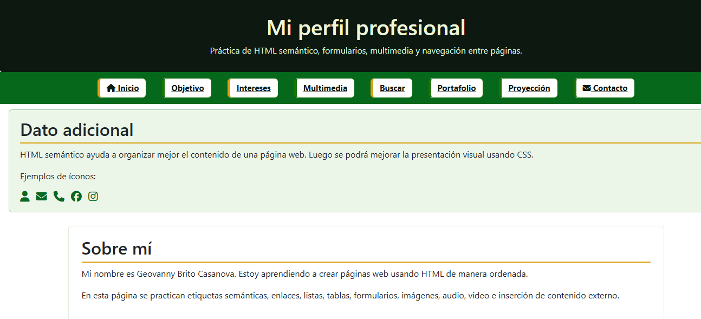
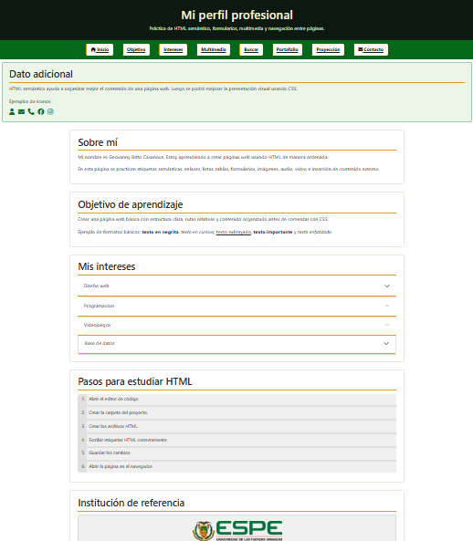
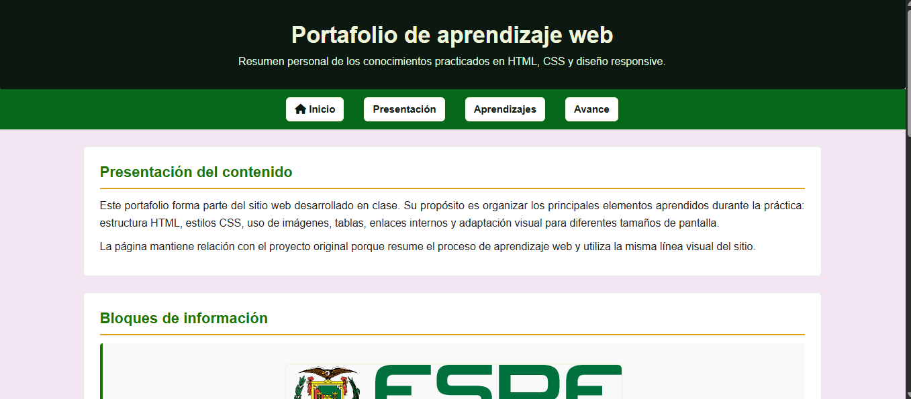

# Practica-Bootstrap
 
> Proyecto de desarrollo web desarrollado en la materia **Fundamentos de Sistemas Web**  
> Ingeniería en Tecnologías de la Información — ITIN
 
---
 
## 📋 Descripción del Proyecto
 
**PracticaCSSFinal** es un sitio web multipage desarrollado con HTML5 y CSS3 como práctica final de la Unidad 2. El proyecto aplica principios de diseño responsivo, semántica HTML, el modelo de caja CSS.
 
El sitio incluye una nueva página de portafolio (`portafolio.html`) que documenta el recorrido de aprendizaje del estudiante, sus habilidades adquiridas y metas profesionales.
 
---
 
## 📁 Estructura de Carpetas
 
```
PRACTICA BOOTSTRAP/
│
├── index.html              → Página principal del sitio
├── buscar.html             → Página de búsqueda
├── contacto.html           → Página de contacto con formulario
├── portafolio.html         → Página de portafolio personal (nueva)
├── README.md               → Documentación del repositorio
│
├── css/
│   ├── general.css         → Estilos globales compartidos
│   ├── index.css           → Estilos específicos del index
│   ├── buscar.css          → Estilos específicos de búsqueda
│   ├── contacto.css        → Estilos específicos del contacto
│   └── portafolio.css      → Estilos específicos del portafolio
│
├── img/
│   ├── espe/               → Imágenes institucionales
│   └── mundito.ico         → Favicon del sitio
│
├── audio/                  → Archivos de audio del proyecto
└── video/                  → Archivos de video del proyecto
```
 
---
 
## 🧩 Componentes de Bootstrap Utilizados
- **Navbar** → navegación principal responsiva.  
- **Grid System** → organización de secciones en columnas.  
- **Cards** → presentación de proyectos futuros.  
- **Accordion** → organización de metas académicas y profesionales.  
- **Progress Bars** → representación gráfica de habilidades.  
- **Modal** → contacto directo desde la página.  
- **Badges y Buttons** → etiquetas y acciones en proyectos.  
 
---
 
## 📄 Páginas del Sitio
 
### `index.html` — Inicio
Página principal del sitio con presentación general y navegación.
 
### `buscar.html` — Búsqueda
Página con funcionalidad de búsqueda de contenido.
 
### `contacto.html` — Contacto
Formulario de contacto responsivo con validación de campos.
 
### `portafolio.html` — Portafolio ⭐ (nueva)
Página personal que incluye:
- Tabla de habilidades con barras de progreso
- Sección de metas profesionales
- Diseño 100% responsivo
---
 
## 📸 Capturas de Pantalla
 
### Vista Escritorio

 
### Vista Móvil

 
### portafolio.html



 
---
 
## 🎨 Características de Diseño
 
- ✅ Diseño responsivo con media queries a 700px
- ✅ Paleta de colores consistente (azul institucional + dorado)
- ✅ Navegación fija (sticky) adaptable a móvil
- ✅ Imágenes fluidas con `max-width: 100%`
- ✅ Box-sizing: border-box en todos los elementos
- ✅ Variables CSS para consistencia visual
- ✅ Semántica HTML5 completa (header, nav, main, section, article, figure, footer)
---
 
##  Autora
 
**Dayana Chavarria**  
Estudiante de Ingeniería en Tecnologías de la Información — ITIN  
Materia: Fundamentos de Sistemas Web  
Año: 2026
 
---
 
## 📝 Notas
 
- Todos los estilos están organizados por página en archivos CSS separados
- El archivo `general.css` contiene estilos globales compartidos por todas las páginas
- Las imágenes están almacenadas en la carpeta `img/`
- El proyecto fue desarrollado como práctica de la Unidad 2
 # PracticaBooststrap
